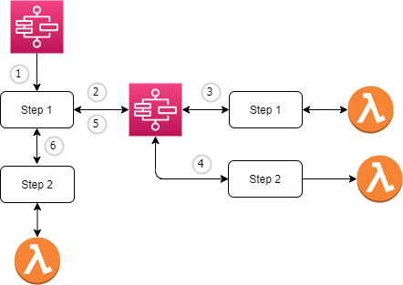

# StepSearch

Simple Terraform project creating a step function that has multiple steps working with Opensearch

### Topology

### Steps

1. Invoke Step funtion 
2. Step 1 execute Extract Lambda Function
3. Step 2 exectues Transform lambda function
4. Step 3 executes Load lambda function
5. Process Ends

## Prerequisites
Before you begin, make sure you have the following prerequisites:

* [Terraform](https://developer.hashicorp.com/terraform/tutorials/aws-get-started/install-cli) installed on your local machine.
* An AWS account.
* AWS access key and secret key with sufficient permissions to create resources.
* I used the following [project](https://github.com/chris-piwinsky/opensearch) to create a publicly accessable opensearch cluster. You will need the output values from that terraform project for input into this one.

## Infrastructure Setup

* Clone the repository to your local machine.
* Navigate to the project directory.
* Create a `terraform.tfvars` adding your AWS_ACCESS_KEY, AWS_SECRET_KEY, and REGION.
* Run `terraform init` to download the necessary provider plugins.
* Run `terraform plan` to preview the changes that Terraform will make to your infrastructure.
* Run `terraform apply` to create the infrastructure on AWS.
* When you are finished using the infrastructure, run `terraform destroy` to delete all the resources that Terraform created.

## Running Step Function

### Through AWS Console

* Navigate to **Step Functions** 
* Select **State Machines**
* click on **step1_function**
* click on **Start Execution** 
* click on **Start Execution** 

### Through AWS CLI

* log into AWS through the CLI
* run the following command `aws stepfunctions start-execution --state-machine-arn <STATE_MACHINE_ARN>`

## Resources

* [Terraform Documentation](https://developer.hashicorp.com/terraform/docs)
* [AWS Provider Documentation](https://registry.terraform.io/providers/hashicorp/aws/latest/docs)
* [Start a Workflow within a Workflow](https://docs.aws.amazon.com/step-functions/latest/dg/sample-start-workflow.html)
* [Working with Neo4j](https://medium.com/@kashish.gakkar/working-with-neo4j-using-python-131ccc074947)

### For MAC

* `terraform init` wouldn't run couldn't find a template for a provider.  Used the [following](https://sharepointdevelopmentblog.wordpress.com/2023/02/07/terraform-template-v2-2-0-does-not-have-a-package-available-mac-m1/) to get it working.

### Neo4j Reference

* [EC2 Neo4j](https://www.inoutcode.com/aws/how-to-setup-neo4j-on-aws-ec2/)
* [Youtube overview](https://www.youtube.com/watch?v=Vu5UQoRuvdM)